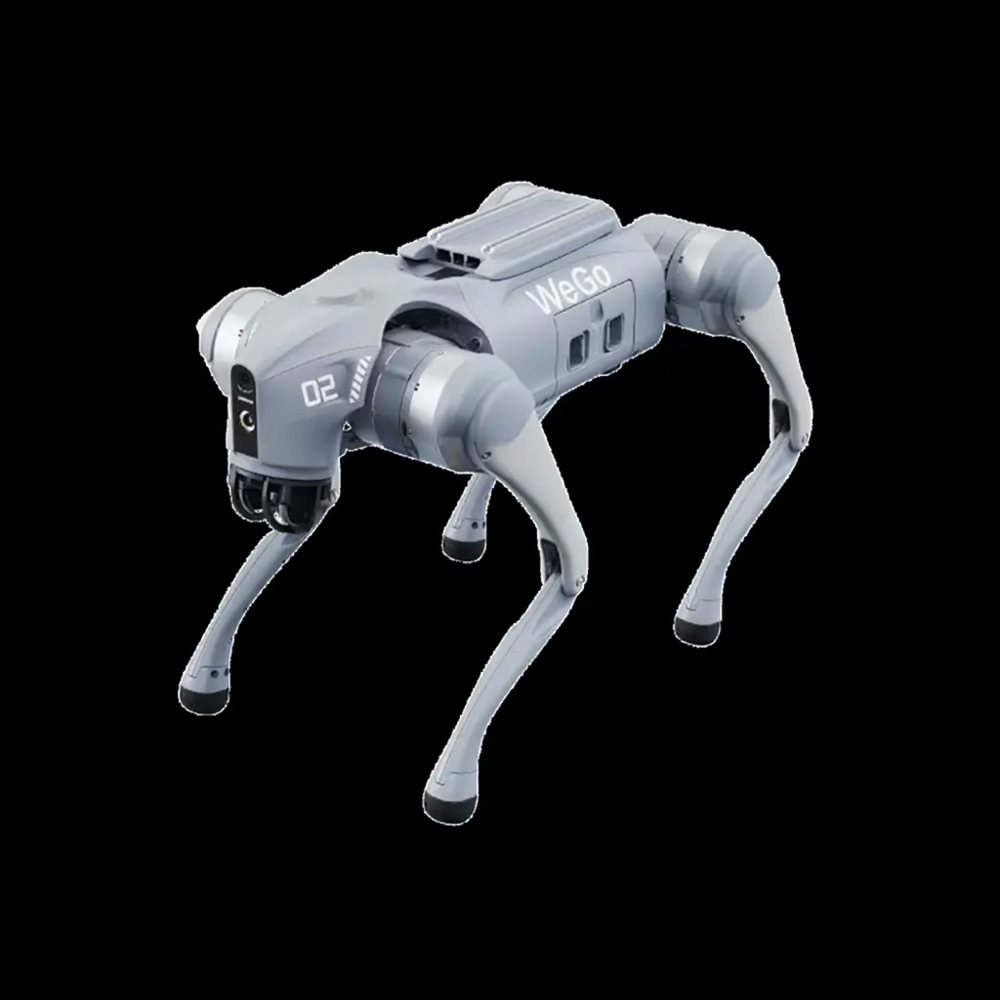
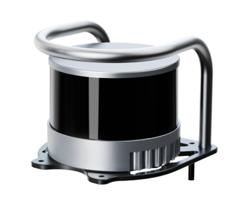
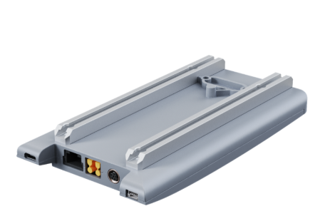
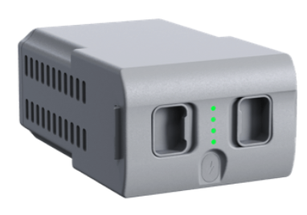
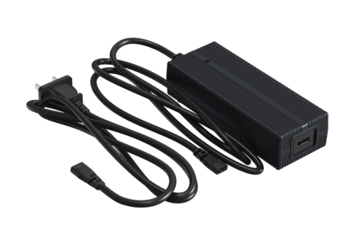
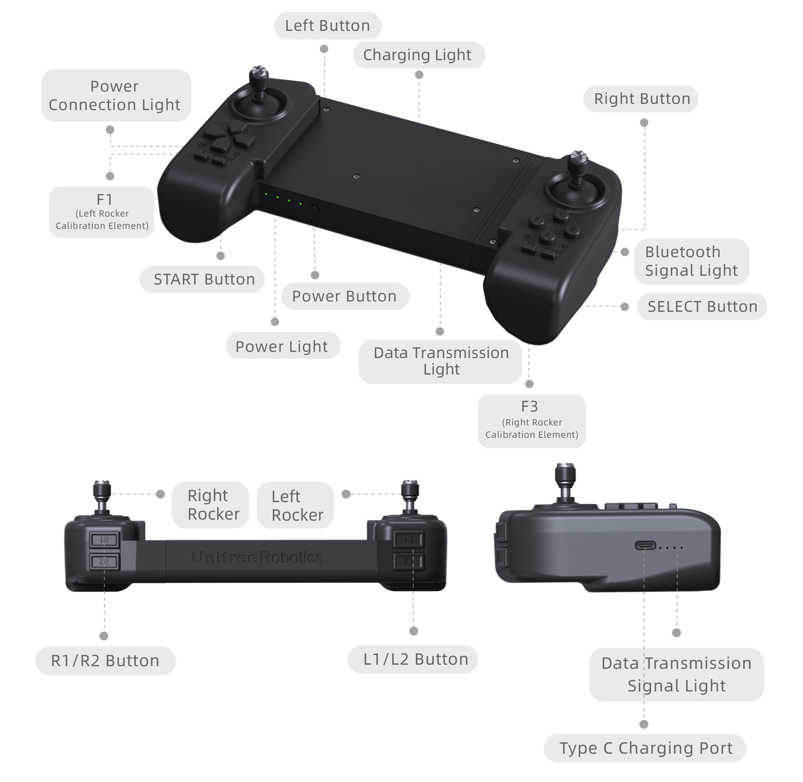
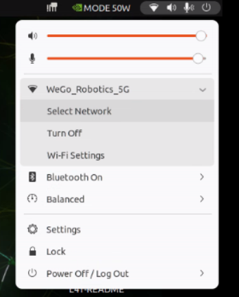
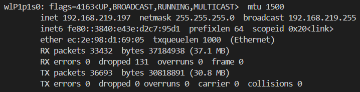
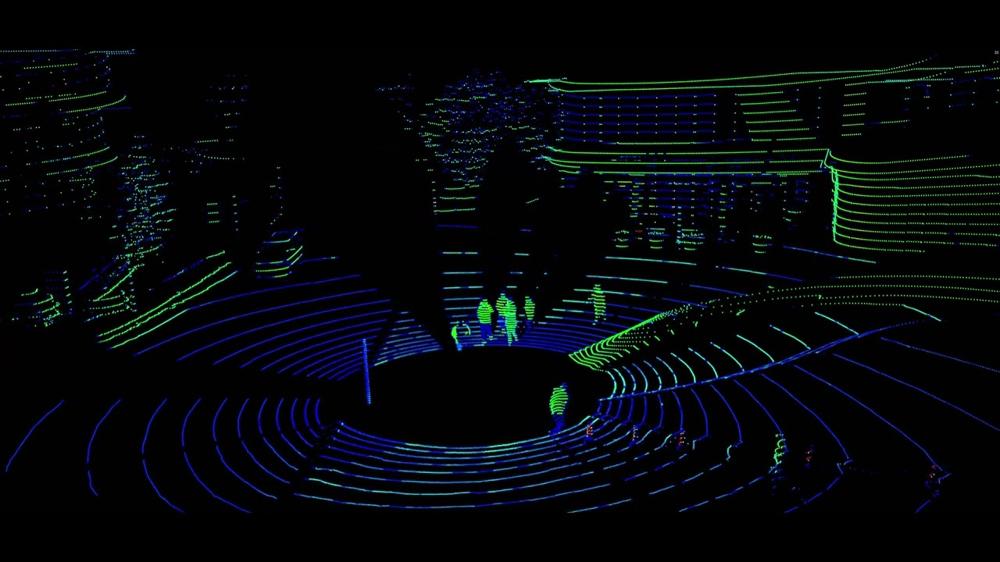

# Go2 Edu 로봇 사용자 안내서

Go2 Edu는 교육·연구용 사족보행 로봇이다. 로봇 본체의 보행 기능에 Jetson AGX 상위 제어기, Hesai XT16 LiDAR, ROS 2 소프트웨어를 더해 환경 인식, 지도 작성, 자율주행 실험에 사용한다.



## 1. Go2 사양 및 개요

| 항목 | 사양 |
|---|---|
| 크기(서 있을 때) | 700 × 310 × 400 mm |
| 크기(웅크릴 때) | 760 × 310 × 200 mm |
| 무게 | 약 15 kg |
| 동작 전압 | 28 ~ 33.6 V |
| 최대 동작 전력 | 약 3,000 W |
| 적재량 | 약 8 kg, 최대 12 kg |
| 주행 속도 | 0 ~ 3.7 m/s (실험실 최고 약 5 m/s) |
| 최대 등반 높이 | 약 16 cm |
| 최대 등반 각도 | 40° |
| 최대 토크 | 약 45 N·m |

출처: [Unitree Go2 공식 사양](https://www.unitree.com/go2/)

Go2 본체는 보행과 자세를 제어한다. 상위 제어기와 센서는 로봇 주변을 인식하고, 지도 작성이나 자율주행 같은 기능을 수행한다.

## 2. 주요 구성품

```text
리모컨 ── Bluetooth ── Go2 본체
                           ├─ Go2 모션 컨트롤러 (.161)
                           ├─ Go2 확장 PC (.18)
                           └─ Jetson AGX 상위 제어기 (.222, eno1)
                                      └─ Hesai XT16 LiDAR (.20)
```

| 구성품 | 역할 |
|---|---|
| Go2 Edu 본체 | 보행·자세 제어, 상태 정보 제공 |
| 리모컨 | 기본 수동 조작과 전원 확인 |
| Jetson AGX 상위 제어기 | ROS 2, 센서 처리, 지도 작성, 자율주행 실행 |
| Hesai XT16 LiDAR | 주변의 3D 포인트클라우드 획득 |
| Go2 모션 컨트롤러 | 저수준 보행 제어 |
| Go2 확장 PC | 인식·자율주행 기능 연결 |
| 배터리·충전기 | 로봇 전원 공급과 충전 |

| Go2 Edu + Hesai XT16 | 상위 컴퓨팅 모듈 |
|---|---|
|  |  |

## 3. 배터리와 전원 켜기 전 유의사항

| 배터리 | 충전기 |
|---|---|
|  |  |

EDU의 장거리 배터리는 `15,000 mAh`이며, 사용 시간은 사용 환경과 주행 조건에 따라 약 `2 ~ 4시간`이다. 고속 충전기는 `33.6 V / 9 A` 규격이며, 로봇의 동작 전압 범위는 `28 ~ 33.6 V`다.

출처: [Unitree Go2 공식 사양](https://www.unitree.com/go2/)

배터리를 장착할 때는 끝까지 밀어 넣어 단단히 고정한다. 배터리를 장착한 뒤에는 접혀 있거나 비정상적인 위치에 있는 다리를 **반드시 원래 자세로 복구한 다음** 로봇 전원을 켠다.

다리 자세가 틀어진 상태에서 전원을 켜면 모터와 관절에 큰 힘이 걸려 로봇에 심각한 고장이 발생할 수 있다.

## 4. 리모컨 설명



### 버튼과 표시등

| 구성 | 용도 |
|---|---|
| 좌·우 스틱 | 로봇을 수동으로 조작할 때 사용 |
| L1/L2, R1/R2 | 보조 기능 입력 |
| START, SELECT, 좌·우 버튼 | 동작 또는 메뉴 선택에 사용 |
| F1, F3 | 좌·우 스틱 보정 버튼. 평소 주행 중에는 누르지 않음 |
| 전원 버튼 | 리모컨 전원 켜기·끄기 |
| 전원·충전 표시등 | 리모컨의 전원과 충전 상태 확인 |
| Power Connection·Bluetooth·Data Transmission 표시등 | 로봇 연결과 통신 상태 확인 |
| Type-C 포트 | 리모컨 충전 |

### 켜기와 끄기

리모컨을 켜거나 끌 때는 전원 버튼을 짧게 한 번 누른 뒤, 다시 2초 이상 길게 누른다.
켜질 때는 알림음이 한 번, 꺼질 때는 세 번 울린다.

### 사용 전 확인

1. 리모컨과 로봇의 배터리 잔량을 확인한다.
2. 스틱이 중앙에 있는지 확인하고, 로봇 주변에 사람이나 장애물이 없는지 살핀다.
3. 연결·통신 표시등이 정상인지 확인한 뒤 조작한다.

스틱과 버튼에 따른 세부 동작은 로봇의 현재 모드에 따라 달라질 수 있다. 예상하지 못한
움직임이 있으면 즉시 스틱을 중립으로 놓고 로봇 주변의 안전을 확보한다.

## 5. Jetson AGX 최초 접속

처음 Wi-Fi를 설정할 때는 이더넷이나 NoMachine 접속을 전제로 하지 않는다. Jetson AGX에 주변기기를 직접 연결해 설정한다.

1. Jetson AGX의 DP 포트에 모니터를 연결한다.
2. USB 키보드와 마우스를 연결한다.
3. Jetson AGX를 켜고 로컬 화면에서 로그인한다.
4. 다음 절의 방법으로 Wi-Fi를 연결한다.

| 항목 | 값 |
|---|---|
| 계정 | `ktl` |
| 비밀번호 | `ktl1234` |

## 6. Wi-Fi 연결과 NoMachine 접속

### Wi-Fi 연결

Jetson AGX의 로컬 화면에서 우상단의 메뉴에서 와이파이 연결.



현재 Jetson AGX에 할당된 주소를 확인. wxxx w로 시작하는 항목의 inet 주소가 ip 주소.

```bash
ifconfig
```




출력된 주소 중 `192.168.219.197` 이 Wi-Fi 네트워크에서의 Jetson AGX IP 주소다. 이후 NoMachine이나 SSH 접속 시 이 주소를 사용한다.

### NoMachine 접속

Wi-Fi 연결이 완료되면 모니터 대신 Jetson AGX의 DP 포트에 DP dummy를 장착한다. 이후 같은 Wi-Fi 네트워크의 PC에서 NoMachine을 열고, 위에서 확인한 Jetson AGX의 Wi-Fi IP 주소로 접속한다.

### SSH 접속

터미널에서 접속할 때도 같은 Wi-Fi IP 주소를 사용한다.

```bash
ssh ktl@<Jetson_AGX_Wi-Fi_IP>
```

### Go2·Hesai 유선 통신

Wi-Fi는 Jetson AGX에 원격으로 접속할 때만 사용한다. Go2와 Hesai XT16은 별도의 유선
인터페이스 `eno1`로 통신하며, 이 주소는 Wi-Fi 연결 후에도 바뀌지 않는다.

| 항목 | 값 |
|---|---|
| 유선 인터페이스 | `eno1` |
| 유선 IP 주소 | `192.168.123.222/24` |

## 7. 센서

### Hesai XT16 LiDAR

Hesai XT16은 주변을 3차원 점들의 집합인 포인트클라우드로 측정하는 16채널 LiDAR다. 획득한 데이터는 지도 작성과 장애물 인식에 사용한다.

| 항목 | 내용 |
|---|---|
| 연결 방식 | Ethernet UDP |
| 채널 수 | 16 채널 |
| 측정 범위 | 0.05 ~ 120 m |
| 시야각 | 수평 360°, 수직 30° |
| 포인트 수 | 320,000 points/s (single return) |
| 거리 정확도 | ±1 cm (typical) |
| 거리 정밀도 | 0.5 cm (1σ, typical) |
| 각도 분해능 | 수평 0.18° (10 Hz), 수직 2° |
| 프레임 주파수 | 5 / 10 / 20 Hz |
| 크기·무게 | 높이 76 mm × 지름 103 mm, 800 g |
| LiDAR IP | `192.168.123.20` |
| UDP 포트 | `2368` |
| PTC 포트 | `9347` |
| ROS 2 frame | `hesai_lidar` |
| ROS 2 토픽 | `/hesai/lidar_points` |

센서 제원 출처: [Hesai PandarXT-16 공식 매뉴얼](https://www.hesaitech.com/wp-content/uploads/2025/04/PandarXT-16_User_Manual_X02-en-250410.pdf)



### Go2 내장 IMU

Go2 본체에 내장된 IMU는 로봇의 방향, 각속도, 선형가속도를 제공한다. 로봇의 자세를 파악하고 주행 상태를 추정하는 데 사용한다.

| 항목 | 내용 |
|---|---|
| 데이터 구성 | 자세 Quaternion, 3축 각속도, 3축 선형가속도 |
| ROS 2 메시지 | `sensor_msgs/msg/Imu` |
| 방향 | Quaternion `x, y, z, w` |
| 각속도 | `x, y, z` 축, `rad/s` |
| 선형가속도 | `x, y, z` 축, `m/s²` |
| 기준 좌표계 | `imu_link` |
| ROS 2 토픽 | `/go2/imu` |
| 방향 공분산 | 제공하지 않음 (`orientation_covariance[0] = -1`) |

내장 IMU의 제조사·세부 모델, 측정 범위, 정확도, 노이즈, 갱신률은 공개된 Go2 사양이나 현재 프로젝트에서 확인되지 않는다. 이 문서에는 검증된 ROS 2 인터페이스 사양만 적는다.

ROS 2 메시지 변환 방식은 [go2_state_bridge.cpp](go2_driver/go2_base/src/go2_state_bridge.cpp)에서 확인할 수 있다.

## 8. 탑재 소프트웨어

이 시스템은 ROS 2 Humble 기반으로 동작한다. 각 소프트웨어는 다음 역할을 담당한다.

| 소프트웨어 | 역할 |
|---|---|
| `go2_base` | Go2 상태·속도 제어 브리지와 Hesai 센서 bringup |
| `hesai_ros_driver` | Hesai XT16 UDP 데이터를 3D 포인트클라우드로 변환 |
| `pointcloud_to_laserscan` | 3D 포인트클라우드를 2D LaserScan으로 변환 |
| `slam_toolbox` | LiDAR와 로봇 이동 정보를 이용한 지도 작성 |
| `Nav2` | 현재 위치 추정, 경로 계획, 장애물 회피, 속도 제어 |
| `RViz2` | 로봇 모델, 센서, 지도, 경로 시각화 |

```text
Hesai XT16 → hesai_ros_driver → PointCloud → LaserScan → slam_toolbox / Nav2
Go2 상태 → go2_base → odom·IMU·배터리 → slam_toolbox / Nav2
```

## 개발 문서

실제 ROS 2 실행 명령, 지도 작성, 자율주행 설정과 개발 방법은 아래 실습 문서에서 다룬다.

- [시스템 구성](ktl/labs/1_system.md)
- [SLAM](ktl/labs/2_slam.md)
- [Navigation](ktl/labs/3_nav.md)
- [명령어 모음](ktl/labs/cmd_manuals.md)
