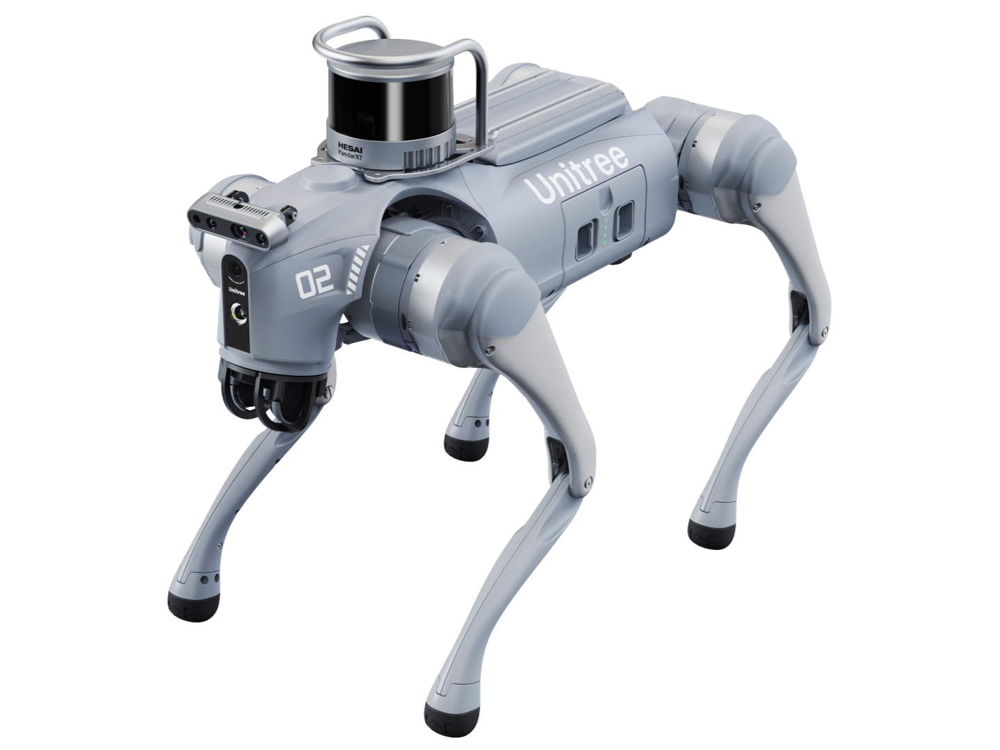
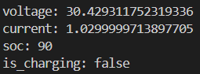
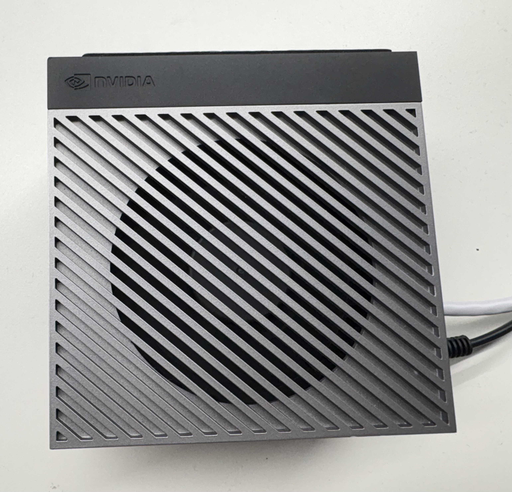
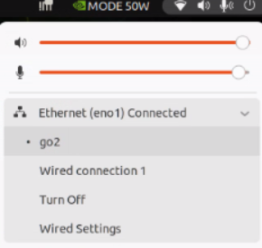
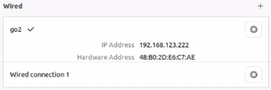
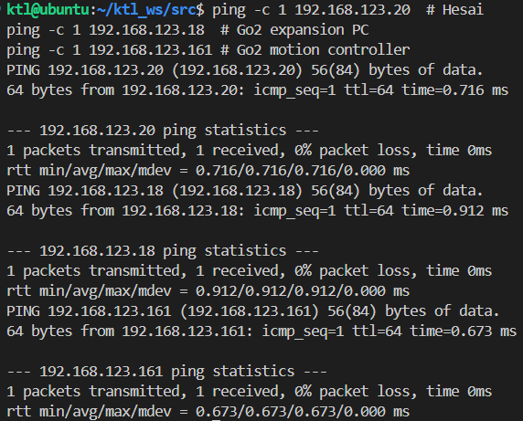
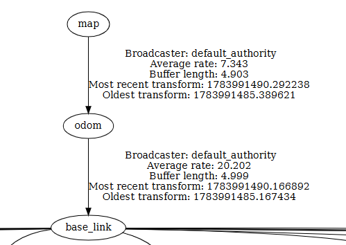
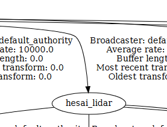
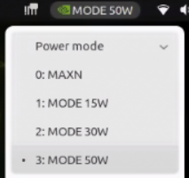

# 1. Go2 시스템과 통신 구조

이 문서는 Go2, Hesai XT16, Jetson Orin으로 구성된 ROS 2 시스템의 구조와 기본 점검 방법을 설명한다. 실습 전에는 [명령어 모음](cmd_manuals.md)의 네트워크 확인부터 수행한다.



이 문서의 범위는 장치 구성, 네트워크, DDS, ROS 2 패키지 구조, 기본 bringup,
데이터 흐름, 빌드와 환경 설정이다


## Jetson AGX 로그인 정보
- id : ktl
- password : ktl1234

## 기본 bringup 실행 [Nomachine]

```bash
source /opt/ros/humble/setup.bash
source ~/ktl_ws/install/setup.bash

ros2 launch go2_base go2_bringup.launch.py rviz:=true
```

### Go2 상태 확인

`go2_state_bridge`가 Unitree DDS 상태를 ROS 2 토픽으로 변환하고 있는지 확인한다.
문제가 생겼을 때는 아래 순서로 Go2 상태 토픽을 점검한다.

| 순서 | 확인 대상 | 정상 판단 |
|---:|---|---|
| 1 | `go2_state_bridge` | 노드가 실행 중이고 종료·예외 로그가 없음 |
| 2 | `/go2/odom` | 위치와 속도가 계속 갱신됨 |
| 3 | `/go2/imu` | 방향·각속도·가속도 값이 수신됨 |
| 4 | `/joint_states` | 관절 이름과 위치 값이 수신됨 |
| 5 | `/go2/battery_state` | 전압·전류·충전 상태가 갱신됨 |

```bash
ros2 node list | grep go2_state_bridge
ros2 topic hz /go2/odom
ros2 topic echo /go2/imu --once
ros2 topic echo /joint_states --once
ros2 topic echo /go2/battery_state --once
```



## 시스템 구성

```text
Go2 모션 컨트롤러 ── Unitree DDS ─┐
Go2 확장 컴퓨터                   ├─ eno1 ─ Jetson Orin AGX (ROS 2)
Hesai XT16 ───────── UDP ───────┘                      │
                                                       ├─ SLAM Toolbox
                                                       ├─ Nav2
                                                       └─ go2_bringup
```

| 구성요소 | 역할 |
|---|---|
| Go2 | 보행 제어와 로봇 상태 제공 |
| Jetson Orin | ROS 2 노드, 센서 처리, SLAM, Navigation 실행 |
| Hesai XT16 | 3D 포인트클라우드 전송 |
| RViz 2 | TF, 센서, 지도, 경로 시각화 |

## 네트워크

모든 장치는 Jetson의 `eno1` 유선 인터페이스를 사용한다. go2의 RJ45 포트가 네트워크 스위치 역할을 수행하여 go2 확장 PC와 Hesai XT16이 Jetson과 통신한다. go2 모션 컨트롤러는 Unitree DDS를 사용하며, Jetson은 ROS 2 CycloneDDS를 사용한다. 두 DDS는 서로 호환되므로, go2 상태와 센서 데이터를 ROS 2에서 구독하고 `/cmd_vel`을 통해 제어 명령을 보낼 수 있다.

| 장치 | IP | 용도 | 사진 |
|---|---|---|---|
| Jetson ROS 호스트 | `192.168.123.222/24` | go2로 명령 하달 및 데이터 습득 |  |
| Go2 모션 컨트롤러 PC | `192.168.123.161` | 보행 제어 |  |
| Go2 확장 PC | `192.168.123.18` | 인식·자율주행용 |  |
| Hesai XT16 | `192.168.123.20` | LiDAR |  |

### 네트워크 연결 확인 

Nomachine으로 접속하여 우상단 메뉴에 wired setting이 `eno1`로 되어 있는지 확인한다. 

Jetson에서 `eno1` 링크가 올라와 있고, go2와 Hesai가 ping에 응답하는지 확인한다.





```bash
ping -c 1 192.168.123.20  # Hesai
ping -c 1 192.168.123.18  # Go2 expansion PC
ping -c 1 192.168.123.161 # Go2 motion controller
```
[result]



### Jetson·확장 PC 시간 동기화

Jetson(`192.168.123.222`)은 시간 서버이고, Go2 확장 PC(`192.168.123.18`)는 Jetson 시간을
자동으로 받는다. LiDAR 메시지의 timestamp는 두 장치의 시간이 맞으면 그대로 사용한다.

`/scan`을 만들 때 원래 timestamp와 Jetson 시간이 `0.2초` 이상 차이 나거나 timestamp가
비어 있으면, 그 메시지만 Jetson 수신 시각으로 바꾼다. 이는 확장 PC 시간이 잘못된 상태에서
SLAM과 Nav2의 TF 오류를 막기 위한 예외 처리다.

```bash
# Go2 확장 PC(.18): Jetson 시간 동기화 상태
timedatectl timesync-status

# Jetson(.222): 시간을 요청한 확장 PC 확인
sudo chronyc clients
```


## ROS 2, DDS, CycloneDDS

ROS 2 노드는 토픽·서비스·액션으로 데이터를 주고받는다. 실제 관리와 전송은 DDS가 담당하며, 그 중 `rmw_cyclonedds_cpp`를 사용한다.

| 계층 | 역할 |
|---|---|
| ROS 2 | 노드, 토픽, 서비스, 액션 인터페이스 |
| RMW | ROS 2와 DDS 구현을 연결 |
| CycloneDDS | 노드 발견과 실제 네트워크 전송 |

Bringup의 `network_interface:=eno1`은 CycloneDDS가 유선망만 사용하도록 제한한다. Wi-Fi·VPN·Docker 인터페이스를 잘못 선택하는 문제를 예방한다.

시스템 bringup의 기본 진입점은
`go2_base/launch/go2_bringup.launch.py`이며, Go2 상태·제어 브리지, 로봇 모델,
Hesai 드라이버를 하나의 launch에서 묶는다.

### DDS 설정 확인하기

평소에는 launch가 `RMW_IMPLEMENTATION=rmw_cyclonedds_cpp`와 `CYCLONEDDS_URI`를 자동 설정하므로 별도 설정 파일을 수정할 필요가 없다. 단독 노드 시험이나 통신 문제 분석 시에는 현재 환경을 확인한다.

```bash
printenv RMW_IMPLEMENTATION
printenv CYCLONEDDS_URI
ip link show eno1
```

직접 실행해야 할 때의 최소 설정 예시다.

```bash
export RMW_IMPLEMENTATION=rmw_cyclonedds_cpp
export CYCLONEDDS_URI='<CycloneDDS><Domain><General><Interfaces><NetworkInterface name="eno1" priority="default" multicast="default" /></Interfaces></General></Domain></CycloneDDS>'
```

이 설정은 현재 터미널에만 적용된다. 인터페이스 이름이 틀렸거나 링크가 내려가 있으면 Unitree DDS를 구독하는 노드가 데이터를 받지 못한다.

## Unitree 데이터를 ROS 2로 연결하는 방법

`go2_state_bridge`는 Unitree DDS 상태를 표준 ROS 2 메시지로 변환한다. `go2_cmd_vel_bridge`는 ROS 2 속도 명령을 Unitree 제어 요청으로 변환한다.

```text
Unitree DDS 상태                         ROS 2 상태
/lf/sportmodestate, /lowstate ──→ go2_state_bridge ──→ /go2/odom, /go2/imu
                                                        /joint_states, /go2/battery_state

ROS 2 제어                              Unitree 제어
/cmd_vel ──→ go2_cmd_vel_bridge ──→ /api/sport/request 또는 /lowcmd
```

`/cmd_vel`은 표준 `geometry_msgs/msg/Twist` 토픽이다. 제어 브리지는 기본적으로 명령이 약 0.5초 동안 끊기면 정지 명령을 보낸다.

### 기본 bringup 구성

`go2_bringup.launch.py`는 다음 기능을 인자로 켜고 끌 수 있다. 상위 응용 launch가
필요한 기능만 골라 포함할 수 있도록 구성되어 있다.

```text
go2_bringup.launch.py
├─ CycloneDDS 환경 설정
├─ go2_description.launch.py
│  └─ robot_state_publisher (URDF → base_link 계열 TF)
├─ go2_state_bridge
│  └─ Unitree 상태 → /go2/odom, /go2/imu, /joint_states, 배터리
├─ go2_cmd_vel_bridge
│  └─ /cmd_vel → Unitree 제어 요청
└─ hesai_ros_driver_node
   └─ Hesai UDP → /hesai/lidar_points
```

| 기능 | 기본값 | 담당 구성 |
|---|---:|---|
| `enable_bridge` | `true` | Unitree 상태를 ROS 2 토픽으로 변환 |
| `enable_control` | `true` | `/cmd_vel`을 Unitree 제어 명령으로 변환 |
| `enable_description` | `true` | URDF와 `robot_state_publisher` 실행 |
| `enable_hesai` | `true` | Hesai XT16 UDP 드라이버 실행 |
| `rviz` | `true` | 기본 로봇 모델 RViz 실행 |
| `rebase_odom_on_start` | `false` | 시작 시 odom 기준점 재설정 |

Mapping과 Navigation은 이 기본 bringup을 내부에서 포함해 센서와 TF를 공유한다.
각 응용 기능의 실행 순서는 [SLAM 실습](2_slam.md)과 [Navigation 실습](3_nav.md)을
참조한다.

## 좌표계와 로봇 모델(URDF)

```text
map → odom → base_link → hesai_lidar
```

[tf 관계도](tf.pdf)

| TF | 발행 주체 | 의미 |
|---|---|---|
| `map → odom` | 상위 위치추정 구성 | 지도 기준 위치 보정 |
| `odom → base_link` | `go2_state_bridge` | Go2 주행 추정 |
| `base_link → hesai_lidar` | URDF / robot_state_publisher | LiDAR 장착 위치와 방향 |

LiDAR의 물리적 위치나 방향은 [go2_description.urdf](../../go2_driver/go2_description/urdf/go2_description.urdf)에서 관리한다. LaserScan에 포함할 높이 범위는 [go2_pointcloud_to_laserscan.yaml](../config/laser_scan/go2_pointcloud_to_laserscan.yaml)에서 관리한다.

|||
|---|---|
|  |  |
|||

## 주요 노드와 토픽

| 노드 | 역할 |
|---|---|
| `go2_state_bridge` | Go2 상태, odom, IMU, 배터리 발행 |
| `go2_cmd_vel_bridge` | `/cmd_vel`을 Go2 명령으로 변환 |
| `hesai_ros_driver_node` | Hesai UDP를 PointCloud2로 변환 |
| `pointcloud_to_laserscan_node` | PointCloud2를 2D LaserScan으로 변환 |
| `slam_toolbox` | LaserScan과 TF를 이용한 지도 생성과 pose graph 관리 |
| Nav2 | 지도·센서·TF를 이용한 위치 추정, 경로 계획, 장애물 회피, 속도 제어 |

| 토픽 | 용도 |
|---|---|
| `/go2/odom` | 로봇 위치·속도 추정 |
| `/go2/imu` | Go2 IMU 상태 |
| `/go2/battery_state` | 배터리 상태 |
| `/hesai/lidar_points` | Hesai 3D 포인트클라우드 |
| `/scan` | SLAM과 Navigation이 사용하는 2D LaserScan |
| `/cmd_vel` | 로봇 속도 명령 |
| `/map`, `/plan` | 지도와 전역 경로 |

```bash
ros2 topic info /go2/odom
ros2 topic echo /go2/battery_state --once
ros2 topic hz /hesai/lidar_points
ros2 node list
```

## 프로젝트 폴더와 설정 파일

```text
src/
├─ go2_driver/
│  ├─ go2_base/          Go2 상태·제어 브리지와 bringup
│  └─ go2_description/   URDF, TF, RViz 설정
├─ hesai_lidar/          Hesai XT16 드라이버 소스
├─ ktl/
│  ├─ config/            LiDAR, SLAM, Nav2 설정
│  ├─ launch/            매핑·내비게이션 launch
│  ├─ maps/              지도와 pose graph
│  └─ labs/              교육 자료
└─ unitree_ros2/         Unitree DDS 메시지·SDK
```

## 설치와 빌드

주요 ROS 의존성은
- `ros-humble-desktop`
- `ros-humble-rmw-cyclonedds-cpp`
- `ros-humble-slam-toolbox`
- `ros-humble-navigation2`
- `ros-humble-nav2-bringup`
- `ros-humble-pointcloud-to-laserscan`
Hesai GPU 빌드에는 CUDA 12.6 필요.

새 Jetson에서 동일한 실습 환경을 준비할 때의 핵심 의존성 설치 명령은 다음과 같다.

```bash
sudo apt update
sudo apt install -y \
  build-essential cmake git ros-dev-tools \
  python3-colcon-common-extensions python3-rosdep \
  ros-humble-desktop ros-humble-rmw-cyclonedds-cpp \
  ros-humble-rosidl-generator-dds-idl \
  ros-humble-slam-toolbox ros-humble-navigation2 \
  ros-humble-nav2-bringup ros-humble-pointcloud-to-laserscan \
  libyaml-cpp-dev libboost-thread-dev libssl-dev libpcl-dev \
  cuda-nvcc-12-6
```

```bash
cd ~/ktl_ws
colcon build --packages-select hesai_ros_driver --symlink-install \
  --cmake-clean-cache \
  --cmake-args -DFIND_CUDA=ON \
  -DCMAKE_CUDA_COMPILER=/usr/local/cuda-12.6/bin/nvcc \
  -DCMAKE_CUDA_ARCHITECTURES=87
colcon build --symlink-install --packages-skip hesai_ros_driver
source install/setup.bash
```

### Jetson 전력 모드

Jetson은 50W 전력 모드를 권장.



## 설정을 바꾼 뒤 해야 할 일

| 변경 대상 | 적용 방법 |
|---|---|
| `ktl/config/*.yaml` | 실행 중인 launch를 종료하고 다시 실행 |
| launch Python 파일 | launch를 종료하고 다시 실행. 설치 공간이 symlink가 아니면 재빌드 필요 |
| C++ 브리지·드라이버 코드 | 해당 패키지 재빌드 후 `source ~/ktl_ws/install/setup.bash` |
| URDF | robot_state_publisher를 포함한 bringup 재실행 |
