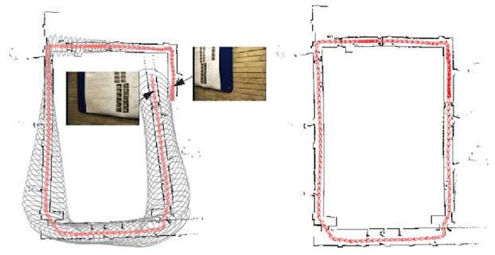
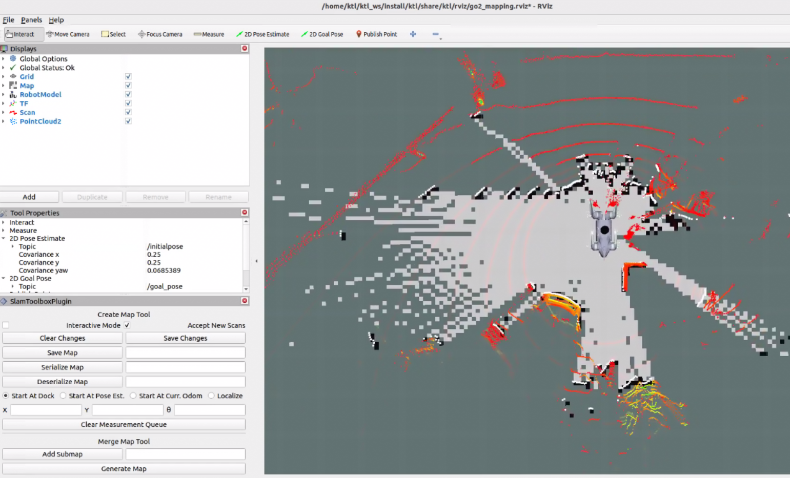
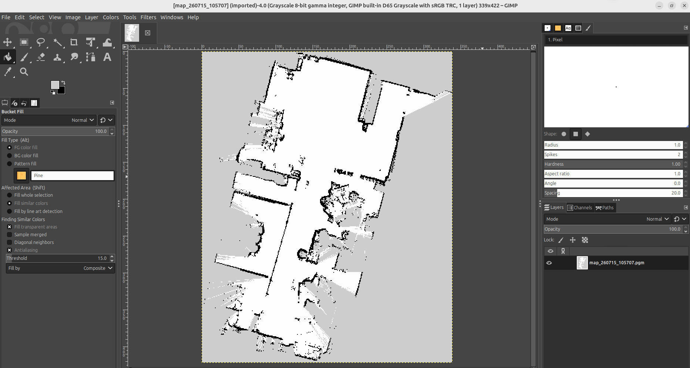
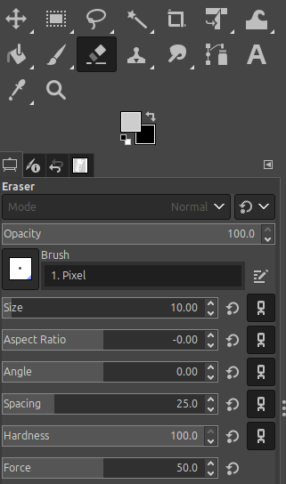

# 2. SLAM으로 지도 만들기

SLAM은 로봇이 움직인 거리와 LiDAR 관측을 이용해 위치와 지도를 함께 만드는 기능이다.
이 시스템에서는 `slam_toolbox`가 `/scan`과 `odom → base_link` TF를 사용한다.

## SLAM에 들어가는 데이터

| 데이터 | 쓰는 곳 |
|---|---|
| `/go2/odom` | 로봇이 움직인 거리와 방향 추정 |
| `/scan` | 벽과 장애물까지의 2D 거리 |
| `/hesai/lidar_points` | `/scan`을 만드는 원본 3D 포인트클라우드 |
| `/go2/imu` | 이 매핑 구성에서는 직접 사용하지 않음 |
| `/cmd_vel` | 매핑 중 수동으로 로봇을 움직일 때 사용 |

## LaserScan이 만들어지는 과정

설정 파일: [go2_pointcloud_to_laserscan.yaml](../config/laser_scan/go2_pointcloud_to_laserscan.yaml)

Hesai는 3D PointCloud를 발행한다. SLAM Toolbox는 2D LaserScan을 사용하므로 다음 과정을
거쳐 `/scan`을 만든다.

1. `/hesai/lidar_points`를 `base_link` 기준으로 변환한다.
2. 지정한 높이 범위 안의 포인트만 남긴다.
3. 남은 포인트를 바닥과 평행한 XY 평면에 투영한다.
4. 생성한 `/hesai/scan_raw`의 시간을 보정해 `/scan`으로 발행한다.

| 파라미터 | 값 | 의미 |
|---|---:|---|
| `target_frame` | `base_link` | LaserScan을 표현할 좌표계 |
| `min_height` | `-0.05 m` | 이보다 낮은 포인트 제외 |
| `max_height` | `0.45 m` | 이보다 높은 포인트 제외 |
| `range_min` | `0.50 m` | 이 거리보다 가까운 포인트 제외 |
| `range_max` | `20.0 m` | 이 거리보다 먼 포인트 제외 |

## SLAM이 지도를 만드는 원리

| 순서 | 하는 일 |
|---:|---|
| 1 | odom으로 로봇이 어디까지 움직였을지 먼저 예상한다. |
| 2 | 새 LaserScan을 이전 관측과 맞춰 위치를 보정한다. |
| 3 | 보정한 위치에 scan을 쌓아 지도를 넓힌다. |
| 4 | 전에 지나간 곳으로 돌아오면 loop closing으로 누적 오차를 줄인다. |

### Odom

Odom은 로봇이 얼마나 움직였는지 나타내는 값이다. `go2_state_bridge`는 Go2 상태를
`/go2/odom`으로 발행하고, 같은 내용을 `odom → base_link` TF로도 보낸다.

SLAM Toolbox는 odom으로 먼저 이동을 예상한 뒤 `/scan`을 지도에 맞춰 위치를 보정한다.
odom만으로는 오래 주행할수록 오차가 쌓이므로 scan matching과 loop closing이 필요하다.

#### `/go2/odom` 메시지 예시

| 항목 | 기준 좌표계 | 의미 | 확인할 값 |
|---|---|---|---|
| `pose` | `odom` | 시작 위치 기준 로봇이 현재 어디에 있고 어느 방향을 보는지 | `position.x`, `position.y`, `orientation` |
| `twist` | `base_link` | 로봇이 지금 얼마나 빠르게 움직이고 회전하는지 | `linear.x`, `linear.y`, `angular.z` |

`pose`는 위치와 방향, `twist`는 속도다. 로봇이 멈추면 `pose`에는 마지막 위치가 남고
`twist`의 속도 값은 0에 가까워진다.

```yaml
header:
  frame_id: odom
child_frame_id: base_link
pose:
  pose:
    position:
      x: 0.00  # odom 기준 앞·뒤 위치(m)
      y: 0.00  # odom 기준 좌·우 위치(m)
      z: 0.05
twist:
  twist:
    linear:
      x: 0.00  # 앞·뒤 속도(m/s)
      y: 0.00  # 좌·우 속도(m/s)
    angular:
      z: 0.00  # 회전 속도(rad/s)
```

로봇이 앞으로 움직이는 중에는 다음처럼 보일 수 있다.

```yaml
header:
  frame_id: odom
child_frame_id: base_link
pose:
  pose:
    position:
      x: 1.25  # 출발점에서 1.25 m 전진한 상황.
      y: 0.03
      z: 0.05
twist:
  twist:
    linear:
      x: 0.15  # 0.15 m/s로 전진 중
      y: 0.00
    angular:
      z: 0.00
```

제자리에서 왼쪽으로 회전하면 `linear.x`는 거의 0이고 `angular.z`는 양수가 된다.
오른쪽 회전에서는 `angular.z`가 음수가 된다.

#### Odom 확인 방법

```bash
ros2 topic echo /go2/odom --once # 내용 확인
ros2 topic hz /go2/odom # 발행 주기 확인
ros2 run tf2_ros tf2_echo odom base_link  # TF 확인
```

### Loop closing

로봇이 전에 지나간 곳으로 돌아오면 SLAM Toolbox는 현재 `/scan`과 저장된 scan을
비교한다. 같은 장소라고 판단하면 그동안 쌓인 위치 오차를 한 번에 보정한다. 이것이
loop closing이다.

loop closing이 일어나면 두 겹으로 보이던 벽과 통로가 다시 맞춰진다. 재방문하지 않은
구간에서는 loop closing이 일어나지 않는다. 현재 `do_loop_closing: true`로 켜져 있다.

벽·기둥·문처럼 구분하기 쉬운 구조가 있는 곳을 지나 시작 지점으로 돌아오는 경로가
확인하기 좋다. 구조가 반복되는 긴 복도나 빈 공간에서는 다른 장소를 같은 곳으로
판단할 수 있다.



#### Loop closing 확인 방법

- 시작 지점으로 돌아온 뒤 RViz에서 벽이 두 겹으로 보이던 부분이 맞춰지는지 본다.
- 다시 왔는데도 변화가 없으면 한 바퀴 더 돈다.
- 지도가 갑자기 크게 휘면 반복되는 복도나 비슷한 벽 때문에 잘못 맞춘 것일 수 있다.

## 지도 만들기

```bash
ros2 launch ktl go2_mapping.launch.py rviz:=true
```



이 명령은 Go2 bringup, Hesai 드라이버, PointCloud → LaserScan 변환, 시간 보정,
SLAM Toolbox, RViz를 함께 실행한다.

### 실행 뒤 확인

로봇을 움직이기 전에 `/scan`, odom, TF가 정상인지 확인한다.

```bash
ros2 topic hz /scan
ros2 topic echo /go2/odom --once
ros2 run tf2_ros tf2_echo odom base_link
```

`/scan`이 계속 들어오고 `odom → base_link` TF가 보이면 로봇을 움직여 매핑을 시작한다.

### 주행 방법

- 시작 전에 RViz에서 `/scan`이 벽과 장애물을 안정적으로 표현하는지 확인한다.
- 벽·기둥처럼 구분하기 쉬운 곳을 따라 천천히 한 바퀴 돈다.
- 급가속하거나 급회전하면 scan matching이 흔들릴 수 있다.
- 시작 지점 근처로 돌아와 loop closing이 일어날 기회를 만든다.
- 지도가 좋지 않으면 설정값보다 TF, 높이 필터, scan 주기, odom을 먼저 확인한다.

## 지도 저장

매핑이 끝나면 Nav2용 지도와 매핑 재개용 pose graph를 저장한다. 파일 이름은
`map_practice`를 예로 든다.

| 저장 대상 | 생성 파일 | 사용하는 곳 |
|---|---|---|
| 점유 지도 | `map_practice.pgm`, `map_practice.yaml` | Nav2 자율주행, GIMP 지도 편집 |
| pose graph | `map_practice.posegraph`, `map_practice.data` | 매핑 재개, 수동 보정 |

PGM·YAML은 Nav2가 읽는 지도다. pose graph는 SLAM Toolbox에서 이전 매핑을 다시 열 때
사용한다. `.posegraph`와 `.data`는 함께 보관한다.

터미널에서 pose graph와 Nav2용 지도를 저장한다.

### 중간 세이브용 pose graph 저장: map_practice.posegraph, map_practice.data
```bash

ros2 service call /slam_toolbox/serialize_map \
  slam_toolbox/srv/SerializePoseGraph \
  "{filename: '/home/ktl/ktl_ws/src/ktl/maps/map_practice'}"
```

### Nav2용 지도 저장: map_practice.pgm, map_practice.yaml
```bash
ros2 run nav2_map_server map_saver_cli \
  -f /home/ktl/ktl_ws/src/ktl/maps/map_practice
```

## 저장한 pose graph를 불러와 이어서 매핑하기

`posegraph` 인자가 비어 있으면 새 graph로 매핑한다. 저장한 graph를 이어 쓰려면
확장자를 뺀 기본 경로를 지정하고, 같은 경로의 `.posegraph`와 `.data` 파일을 함께 둔다.

처음 매핑을 시작했던 위치에서 재개하는 예시는 다음과 같다.

```bash
ros2 launch ktl go2_mapping.launch.py \
  posegraph:=/home/ktl/ktl_ws/src/ktl/maps/map_practice \
  map_start_pose:='[0.0, 0.0, 0.0]' \
  rviz:=true
```

`map_start_pose`는 저장된 지도 좌표계에서 로봇이 시작할 실제 `[x, y, yaw]`다. 저장 당시
시작 지점에서 재개하면 `[0.0, 0.0, 0.0]`을 쓰고, 다른 위치에서 재개하면 그 위치의 지도
좌표를 정확히 지정한다. 초기 위치가 틀리면 scan matching이 잘못되어 지도가 휘거나 깨질 수
있다.

```bash
ros2 service call /slam_toolbox/deserialize_map \
  slam_toolbox/srv/DeserializePoseGraph \
  "{filename: '/home/ktl/ktl_ws/src/ktl/maps/map_practice', match_type: 2, initial_pose: {x: 0.0, y: 0.0, theta: 0.0}}"
```

## 저장한 지도 편집하기

지도에서 없애고 싶은 노이즈를 지우거나, 실제로 막힌 곳을 장애물로 표시해야 할 때는
PGM 파일을 수정한다. 이 작업은 Nav2용 점유 지도만 바꾸며, SLAM Toolbox의 pose graph는
바뀌지 않는다.

### 1. 원본 백업

원본 파일을 직접 덮어쓰지 말고, 수정본을 별도 이름으로 만든다.

```bash
cd ~/ktl_ws/src/ktl/maps
cp map_practice.pgm map_practice_edited.pgm
cp map_practice.yaml map_practice_edited.yaml
```

### 2. GIMP에서 PGM 수정

`map_practice_edited.pgm`을 GIMP로 열고 Pencil처럼 경계가 흐려지지 않는 도구를 쓴다.



| 색 | Nav2가 해석하는 의미 | 사용할 때 |
|---|---|---|
| 검정 | 장애물 | 벽·출입 금지 구역을 추가할 때 |
| 흰색 | 이동 가능한 공간 | 잘못 들어간 장애물을 지울 때 |
| 회색 | 알 수 없는 공간 | 관측하지 않은 영역으로 남길 때 (바깥 영역) |



해당 툴을 이용하여 그림판 다루듯 지도의 해당 부분을 수정한다.

색상 선택에는 스포이드 도구를 사용한다.

수정이 끝나면 같은 이름의 `map_practice_edited.pgm`으로 내보낸다. 형식은 8비트
grayscale PGM으로 유지하고, 색상 이미지나 알파 채널을 넣지 않는다.

파일 저장에는 **overwrite**를 선택한다.

### 3. YAML 파일 이름 확인

`map_practice_edited.yaml`의 `image:`가 수정한 PGM 파일을 가리키게 바꾼다.

```yaml
image: map_practice_edited.pgm
```

이미지 크기를 바꾸지 않았다면 `resolution`과 `origin`은 원래 값 그대로 둔다.

### 4. Navigation에서 확인

수정한 지도를 열어 벽을 지운 곳과 새로 막은 곳이 의도대로 보이는지 확인한다.

```bash
ros2 launch ktl go2_navigation.launch.py \
  map:=/home/ktl/ktl_ws/src/ktl/maps/map_practice_edited.yaml \
  rviz:=true
```

RViz에서 2D Pose Estimate로 초기 위치를 잡은 뒤, 수정한 구역이 지도와 costmap에
같이 반영되는지 확인한다.

## 주요 설정값

설정 파일: [go2_slam_toolbox.yaml](../config/slam/go2_slam_toolbox.yaml)

| 파라미터 | 현재 값 | 의미 |
|---|---:|---|
| `odom_frame`, `map_frame`, `base_frame` | `odom`, `map`, `base_link` | SLAM 좌표계 |
| `scan_topic` | `/scan` | 입력 LaserScan |
| `resolution` | `0.05 m` | 지도 셀 크기 |
| `map_update_interval` | `2.0 s` | 지도 갱신 주기 |
| `minimum_travel_distance` | `0.15 m` | 이 거리 이상 이동 시 스캔 처리 |
| `minimum_travel_heading` | `0.15 rad` | 이 각도 이상 회전 시 스캔 처리 |
| `do_loop_closing` | `true` | 재방문 장소의 drift 보정 |

처음에는 TF와 `scan_topic`, 레이저 범위가 맞는지 먼저 확인하고, 세부 파라미터는 그 다음에 조정한다.

### 지도 품질이 좋지 않을 때

| 현상 | 먼저 확인 | 이후 조정 후보 |
|---|---|---|
| 벽이 두 겹으로 보임 | TF, scan timestamp, odom drift | `minimum_travel_*`, scan matching 범위 |
| 지도가 너무 듬성듬성함 | `throttle_scans`, 이동 속도 | `minimum_travel_distance`, `minimum_travel_heading` 낮춤 |
| CPU 사용량이 높음 | scan 주기, map 해상도 | `throttle_scans`, `minimum_time_interval`, `resolution` |
| loop가 잘 안 닫힘 | 실제로 재방문했는지, scan 품질 | loop 응답 임계값·검색 범위 |
| 잘못된 loop로 지도 휨 | 반복 구조 환경인지, TF | loop 응답 임계값을 높여 후보를 엄격화 |

한 번에 한 종류의 값만 작게 바꾸고, 같은 경로를 다시 주행해 전후 지도를 비교한다.
