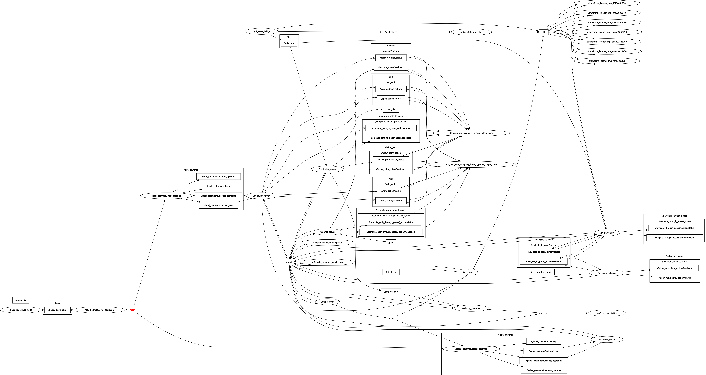
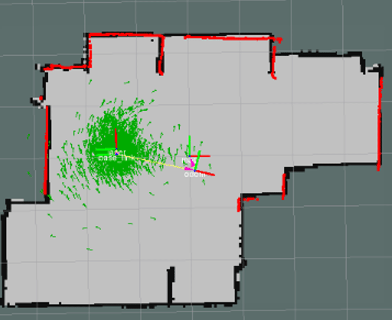
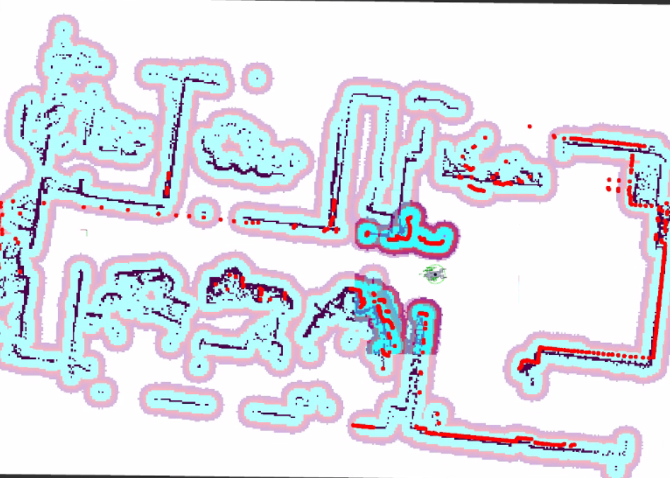
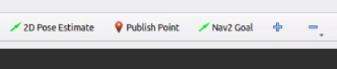
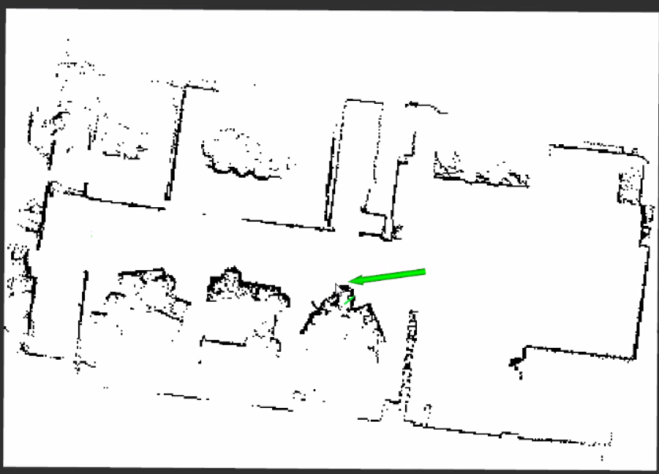
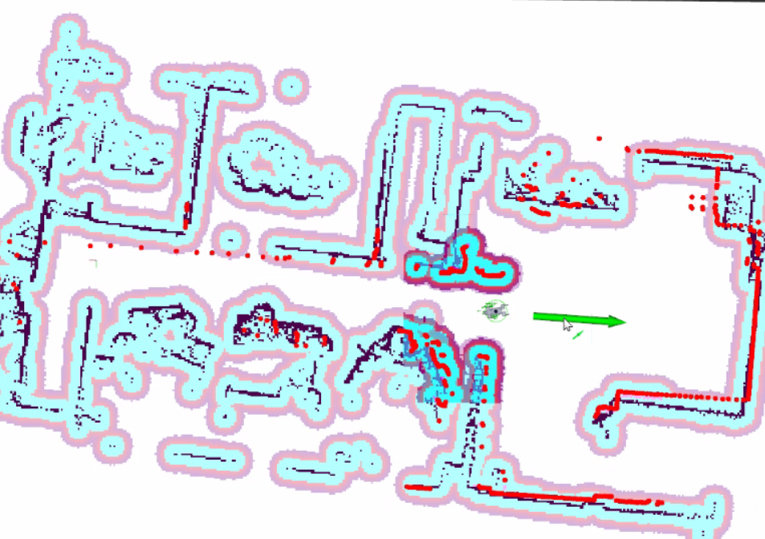
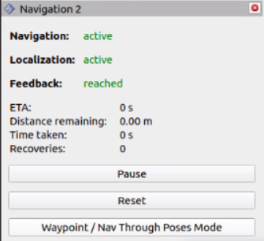

# 3. Nav2로 자율주행하기

현재 Navigation은 전역 플래너 NavFn과 로컬 컨트롤러 DWB를 사용한다. 저장된 지도에서 AMCL로 위치를 찾고, LiDAR 기반 costmap으로 장애물을 피하며 `/cmd_vel`을 생성한다.

## Navigation에 들어가는 데이터

| 입력·출력 | 역할 |
|---|---|
| `map.yaml`, `map.pgm` | 로봇이 주행할 정적 지도 |
| `/scan` | 현재 벽과 장애물의 거리 |
| `/go2/odom` | 짧은 시간 동안의 로봇 이동량 |
| `map → odom → base_link` TF | 지도·주행 추정·로봇 몸체 좌표계 연결 |
| `/cmd_vel` | Nav2가 Go2에 보내는 속도 명령 |

`/scan`과 저장된 지도를 비교해 현재 위치를 찾고, 그 위치에서 목표까지의 경로와
속도를 계산한다.

아래 그림은 Navigation 실행 시 연결되는 주요 노드와 토픽이다. 모든 항목을 외울
필요는 없지만, `/scan`, `/go2/odom`, TF가 Nav2로 들어가고 `/cmd_vel`이 Go2로
나간다는 흐름을 확인할 때 사용할 수 있다.



## Nav2가 주행하는 원리

```text
map.yaml → map_server → global costmap → NavFn 전역 경로
                                              │
/scan + TF + /go2/odom → local costmap → DWB 속도 선택
                                              │
                                              ▼
                                     /cmd_vel → Go2
```

| 구성요소 | 역할 |
|---|---|
| AMCL | 지도와 `/scan`을 비교해 `map → odom` 보정 |
| Global costmap | 지도 전체의 통행 가능 영역과 장애물 주변 여유 거리 관리 |
| NavFn | 시작점에서 목표점까지 전역 경로 생성 |
| Local costmap | 로봇 주변의 최신 장애물 반영 |
| DWB | 후보 속도를 평가해 `/cmd_vel` 발행 |

### AMCL로 현재 위치 찾기

AMCL은 `/scan`을 저장된 지도와 비교해 `map → odom` TF를 추정한다. odom은 짧은 시간 이동을 부드럽게 연결하고, AMCL은 장기 누적 오차를 지도 기준으로 보정한다. 따라서 RViz에서 로봇 모델이 지도 위에 맞아 보여도 `/scan`의 벽이 지도 벽과 맞지 않으면 위치는 다시 틀어진다.

AMCL은 처음부터 로봇의 위치를 하나로 단정하지 않는다. 지도 위에 여러 개의 위치·방향
후보를 뿌리는데, 이 후보 하나를 **particle(입자)** 이라고 한다. 로봇이 움직이면 odom을
이용해 각 particle도 함께 움직이고, LiDAR가 본 벽 모양이 지도와 잘 맞는 particle에는
높은 점수를 준다. 점수가 낮은 후보는 줄이고 높은 점수의 후보를 늘리는 과정을 반복하면,
particle이 실제 위치 주변에 모인다. 이 모인 결과가 `/amcl_pose`와 `map → odom` 보정에
사용된다.

아래 화면의 초록 점들이 particle이다. 처음 위치가 부정확하거나 주변 구조가 비슷하면
particle이 넓게 퍼질 수 있다. 위치 추정이 안정되면 점들이 한 곳에 모이고, 로봇이 이동할
때도 지도와 LiDAR 관측이 함께 맞아야 한다.



이 설정의 AMCL은 전진·횡이동·회전을 모두 고려해 particle을 움직이는
`OmniMotionModel`을 사용한다. particle 수는 상황에 따라 500~2000개 사이에서
조절된다. 로봇이 `0.10 m` 이상 움직이거나 `0.10 rad` 이상 회전하면 새 `/scan`으로
위치를 다시 평가한다. 사람이나 다른 로봇처럼 지도에 없는 물체가 LiDAR에 잡혔을 때는,
그 측정값의 영향을 줄이도록 beam skipping도 켜 두었다.

위치가 불안정하면 설정값부터 바꾸기보다 다음을 먼저 확인한다.

1. `2D Pose Estimate`로 실제 위치와 방향을 올바르게 지정했는지
2. RViz에서 LiDAR 관측과 지도 벽이 맞는지
3. `map → odom → base_link` TF와 `/scan`이 계속 들어오는지

`alpha1~alpha5`는 odom 오차를 얼마나 넓게 반영할지 정하는 고급 설정이다. 위 항목이
정상인데도 주행할수록 위치가 계속 밀릴 때만 작은 폭으로 조정한다.

### Costmap: Nav2가 보는 주행용 지도

costmap은 단순한 지도 이미지가 아니라, Nav2가 **어디를 지나도 되는지와 장애물에서
얼마나 떨어져야 하는지** 판단하도록 만든 2D 격자 지도다. 정적 지도 벽, LiDAR로 새로
관측한 장애물, 장애물 주변의 안전 여유를 한 장에 합친다.

아래 화면에서 검은 선은 지도에 있는 벽·구조물, 빨간 점은 LiDAR 관측이다. 하늘색과
보라색 띠는 장애물 주변에 만든 costmap 영역으로, 로봇은 이 영역의 중앙보다는 빈 공간을
우선해서 지나려 한다. 색은 RViz 설정에 따라 달라질 수 있다.



| 구분 | 기준 좌표계·범위 | 하는 일 |
|---|---|---|
| Global costmap | `map` 프레임, 지도 전체 | 목적지까지 큰 경로를 만들 때 사용 |
| Local costmap | `odom` 프레임, 로봇 주변 `5 m × 5 m` | 눈앞 장애물을 피할 속도를 고를 때 사용 |

관측하지 않은 영역은 지도에서 회색(`205`)인 unknown으로 남긴다. 현재 설정은
`track_unknown_space: true`, `allow_unknown: false`이므로 경로가 이 영역을 통과하지 않는다.
미탐사 영역이 흰색(`255`)이면 Nav2는 이미 확인한 빈 공간으로 해석하므로, GIMP에서 회색으로
바꿔야 한다.

Local costmap은 `/scan`을 `8 Hz`로 반영한다. 관측된 물체는 장애물로 표시하고,
LiDAR가 빈 공간을 다시 보면 오래된 장애물 표시는 지운다. 장애물이 사라졌는데도 화면에
남아 있으면 `/scan`, TF, LiDAR의 빈 공간 관측을 먼저 확인한다.

#### 장애물과의 안전거리

장애물 바로 옆은 충돌 위험이 있으므로, costmap은 장애물에서 멀어질수록 통과하기 좋은
영역이 되도록 비용을 낮춘다. 현재 설정은 로봇 반경 `0.28 m`에 더해 로컬에서는 `0.45 m`,
전역에서는 `0.50 m`까지 여유 영역을 만든다.

벽에 너무 붙어 주행하면 이 여유 거리를 키운다. 반대로 실제로 통과 가능한 좁은 길을
막힌 길로 판단하면 로봇 반경과 여유 거리를 실제 환경에 맞춰 검토한다. LiDAR 높이나 TF가
잘못된 문제는 이 값만 바꿔서는 해결되지 않는다.

### 경로 계획: NavFn

NavFn은 global costmap에서 현재 위치부터 목표까지의 **큰 경로**를 만든다. 현재
`nav2_navfn_planner/NavfnPlanner`를 사용하며, A* 방식으로 통과 비용이 낮은 길을 찾는다.
목표를 보내면 이 결과가 `/plan`으로 나오고, 주행 중에는 초당 한 번씩 경로를 다시
계산한다.

### 장애물 회피와 컨트롤러: DWB

DWB는 전역 경로를 그대로 따라가기만 하지 않는다. local costmap을 보면서 여러 속도
후보를 약 `1.2초` 앞까지 예상해 보고, 충돌하지 않으면서 경로와 목표에 잘 맞는 속도를
골라 `/cmd_vel`로 보낸다. 현재 계산 주기는 `15 Hz`다.

| 파라미터 | 현재 값 | 의미 |
|---|---:|---|
| `controller_frequency` | `15 Hz` | 속도 명령 계산 주기 |
| `max_vel_x` | `0.35 m/s` | 전진 최대 속도 |
| `max_vel_y` | `0.15 m/s` | 횡이동 최대 속도 |
| `max_vel_theta` | `0.8 rad/s` | 회전 최대 속도 |
| `sim_time` | `1.2 s` | 각 속도 후보를 미리 예상하는 시간 |

`max_vel_y`가 크면 옆으로 걷는 후보가 늘어난다. 전진이 아닌 횡이동이 자주 나오면 이
값과 아래 평가 기준을 함께 확인한다.

| critic | 판단 기준 |
|---|---|
| `BaseObstacle` | 충돌하거나 장애물에 너무 가까운 후보 제거 |
| `PathAlign`, `PathDist` | 전역 경로 방향과 거리 유지 |
| `GoalAlign`, `GoalDist` | 목표 위치·방향 접근 |
| `RotateToGoal` | 목표 근처에서 목표 yaw 맞춤 |
| `Oscillation` | 좌우·앞뒤 반복 움직임 억제 |

`progress_checker`는 10초 안에 0.3m 이상 진행하지 못하면 진행 실패로 판단한다. 이 값은
좁은 곳에서 정지한 로봇을 실패로 판단하는 기준이지, 목표 도착 판정값은 아니다.

### 길을 못 찾을 때의 복구 동작

Nav2는 경로를 따라가지 못했다고 바로 목표를 취소하지 않는다. **BT(Behavior Tree)**가
"다시 계획하기 → 그래도 안 되면 복구 동작하기 → 다시 주행하기" 순서를 관리한다.
`behavior_server`는 회전·후진·대기 같은 동작을 실제로 실행하고, **언제 무엇을 할지**는
BT XML이 정한다.

현재는 별도 BT 파일을 지정하지 않아 Nav2 Humble의 기본
`navigate_to_pose_w_replanning_and_recovery.xml`을 사용한다. 기본 순서는 다음과 같다.

```text
주행 중 실패
 ├─ 경로 계획 실패: global costmap을 비우고 경로를 한 번 더 계산
 ├─ 경로 추종 실패: local costmap을 비우고 경로를 한 번 더 추종
 └─ 계속 실패: 복구 동작 하나 실행 → 다시 계획·주행
                    ├─ local·global costmap 모두 비우기
                    ├─ 약 90° 제자리 회전
                    ├─ 5초 대기
                    └─ 0.30 m를 0.05 m/s로 후진
```

마지막 네 동작은 순서대로 돌아가며 실행된다. 복구 동작을 하나 수행한 뒤에도 주행을
다시 시도하며, 기본 BT는 이 과정을 최대 6회 재시도한다. 예를 들어 로그에
`[behavior_server]: Running backup`이 보이면, 경로 추종 또는 계획이 계속 실패해
BT가 마지막 후진 복구 단계로 넘어간 것이다. 이것은 Go2의 보행 모드를 바꾸는 동작이
아니라 `/cmd_vel`로 잠시 후진 속도를 보내는 Nav2 동작이다.

#### 어떤 값을 어디서 바꾸는가

| 원하는 변경 | 수정 위치 | 바꾸는 내용 |
|---|---|---|
| TF가 잠깐 늦을 때 복구가 너무 빨리 시작됨 | `config/nav2/go2_nav2_params.yaml`의 `controller_server` | `failure_tolerance`, `transform_tolerance`를 확인. TF 오류 자체도 함께 해결해야 함. |
| 복구 회전의 속도·가감속 조정 | 같은 파일의 `behavior_server` | `max_rotational_vel`, `min_rotational_vel`, `rotational_acc_lim` |
| 후진 거리·후진 속도·대기 시간·회전 각도 변경 | **사용자 BT XML** | `BackUp`, `Wait`, `Spin` 태그의 값을 변경 |
| 후진 복구를 사용하지 않음 | **사용자 BT XML** | `BackUp` 태그를 제거 |
| 전체 복구 재시도 횟수 변경 | **사용자 BT XML** | 최상위 `RecoveryNode`의 `number_of_retries` 변경 |

`behavior_server`의 회전 속도 설정만 바꿔서는 기본 후진 거리 `0.30 m`나 후진 속도
`0.05 m/s`가 바뀌지 않는다. 이 값들은 기본 BT XML의 `BackUp` 태그에 들어 있기
때문이다.

#### 복구 순서를 바꾸는 방법

기본 BT 파일이 있는 `/opt/ros/...` 경로를 직접 수정하지 않는다. 업데이트나 재설치 때
사라질 수 있으므로 프로젝트에 복사본을 만들어 사용한다.

```bash
cd ~/ktl_ws/src/ktl
cp \
  /opt/ros/humble/share/nav2_bt_navigator/behavior_trees/navigate_to_pose_w_replanning_and_recovery.xml \
  config/nav2/go2_recovery.xml
```

복사한 `config/nav2/go2_recovery.xml`에서 아래 항목을 찾으면 복구 동작을 바꿀 수 있다.

```xml
<Spin spin_dist="1.57"/>
<Wait wait_duration="5"/>
<BackUp backup_dist="0.30" backup_speed="0.05"/>
```

예를 들어 후진을 사용하지 않으려면 `BackUp` 한 줄만 삭제한다. 수정한 파일을 쓰도록
`go2_nav2_params.yaml`의 `bt_navigator` 아래에 경로를 추가한다.

```yaml
default_nav_to_pose_bt_xml: /home/ktl/ktl_ws/install/ktl/share/ktl/config/nav2/go2_recovery.xml
```

그 뒤 빌드하고 Navigation을 다시 시작한다.

```bash
cd ~/ktl_ws
colcon build --packages-select ktl --symlink-install
source install/setup.bash
```

후진을 제거하면 막힌 상황에서 로봇이 스스로 빠져나올 기회도 줄어든다. 실내에서 후진이
위험한 환경일 때만 제거하고, 먼저 costmap·TF·초기 위치가 정상인지 확인한다.

## 자율주행 시작하기

```bash
source /opt/ros/humble/setup.bash
source ~/ktl_ws/install/setup.bash

ros2 launch ktl go2_navigation.launch.py \
  map:=/home/ktl/ktl_ws/src/ktl/maps/map_practice.yaml \
  rviz:=true
```

지도 YAML의 `image:`가 실제 PGM 파일을 가리켜야 한다. Navigation
launch는 Go2 bringup, Hesai 드라이버, LaserScan 변환, Nav2, RViz를 함께 실행한다.

### 실행 뒤 확인

처음에는 아직 AMCL 초기 위치를 주지 않았으므로, 지도·scan·odom TF가 정상인지 먼저
확인한다.

```bash
ros2 topic echo /map --once
ros2 topic hz /scan
ros2 run tf2_ros tf2_echo odom base_link
```

`/map`이 보이고 `/scan`이 계속 들어오며 `odom → base_link` TF가 출력되면 다음 단계로
진행한다.

## RViz에서 목표 보내기

RViz 상단 도구 모음에서 `2D Pose Estimate`로 초기 위치를 지정하고, `Nav2 Goal`로
목표를 보낸다.



### 1. 초기 위치 지정

1. Fixed Frame을 `map`으로 설정한다.
2. `2D Pose Estimate`를 선택한다.
3. 지도에서 실제 위치를 클릭하고 실제 방향으로 드래그한다.
4. AMCL 포즈가 지도 위에서 안정되는지 확인한다.

초록색 화살표의 시작점은 로봇 위치이고, 화살표 방향은 로봇이 바라보는 방향이다.



초기 위치를 보낸 뒤에는 LiDAR 점과 costmap이 지도와 자연스럽게 맞는지 확인한다.

```bash
ros2 topic echo /initialpose --once
ros2 topic echo /amcl_pose --once
```

### 2. 목표 전송

1. `Nav2 Goal`을 선택한다.
2. 목표 위치를 클릭하고 목표 방향으로 드래그한다.
3. `/plan`과 `/cmd_vel`이 생성되는지 확인한다.

목표 화살표의 방향은 도착 후 로봇이 바라볼 방향이다.



도착은 위치와 방향을 모두 만족해야 한다.

| 파라미터 | 현재 값 | 의미 |
|---|---:|---|
| `xy_goal_tolerance` | `0.20 m` | 목표 위치 허용 오차 |
| `yaw_goal_tolerance` | `0.20 rad` | 목표 방향 허용 오차 |
| `stateful` | `true` | 위치 판정 후 방향 판정을 유지 |

목표에서 계속 회전하면 goal tolerance, DWB `RotateToGoal`, `/go2/odom`, `/cmd_vel` timeout을 함께 확인한다.

## `/cmd_vel`로 속도 명령하기

`/cmd_vel`의 타입은 `geometry_msgs/msg/Twist`다. 이는 “어디로 이동할지”가 아니라 **지금부터 어느 방향으로 얼마나 빠르게 움직일지**를 보내는 속도 명령이다. Nav2의 DWB나 수동 명령 노드가 계속 발행하고, `go2_cmd_vel_bridge`가 이를 Unitree 이동 명령으로 변환한다.

현재 Go2 브리지가 사용하는 필드는 세 개다.

| 필드 | 단위 | 양수 방향 | Go2에서의 의미 |
|---|---|---|---|
| `linear.x` | m/s | 앞 | 전진 속도. 음수면 후진 |
| `linear.y` | m/s | 왼쪽 | 횡이동 속도. 음수면 오른쪽 이동 |
| `angular.z` | rad/s | 반시계 방향 | 좌회전 속도. 음수면 우회전 |

`linear.z`, `angular.x`, `angular.y`는 이 지상 주행 브리지에서 사용하지 않으므로 0으로 둔다. 현재 Nav2의 최대 출력은 전진 `0.35 m/s`, 횡이동 `0.15 m/s`, 회전 `0.8 rad/s`다.

| 의도 | 핵심 값 | 예시 |
|---|---|---|
| 직진 | `linear.x` | `x: 0.10` |
| 전진하며 좌회전 | `linear.x` + `angular.z` | `x: 0.10`, `z: 0.30` |
| 제자리 좌회전 | `angular.z` | `z: 0.30` |
| 좌측 횡이동 | `linear.y` | `y: 0.05` |

횡이동은 Go2가 옆으로 걷게 하므로, 전진하며 곡선 주행을 원할 때는 보통 `linear.x`와 `angular.z`를 함께 사용하고 `linear.y`는 0에 가깝게 둔다. 수동 명령은 안전한 장소에서 낮은 속도로만 시험한다.

```bash
ros2 topic pub --rate 10 /cmd_vel geometry_msgs/msg/Twist \
  "{linear: {x: 0.10, y: 0.0, z: 0.0}, angular: {x: 0.0, y: 0.0, z: 0.0}}"
```

전진하며 좌회전:

```bash
ros2 topic pub --rate 10 /cmd_vel geometry_msgs/msg/Twist \
  "{linear: {x: 0.10, y: 0.0, z: 0.0}, angular: {x: 0.0, y: 0.0, z: 0.30}}"
```

정지 명령:

```bash
ros2 topic pub --once /cmd_vel geometry_msgs/msg/Twist \
  "{linear: {x: 0.0, y: 0.0, z: 0.0}, angular: {x: 0.0, y: 0.0, z: 0.0}}"
```

진행 중인 Nav2 목표를 모두 취소하려면 action의 cancel 서비스를 호출한다. 목표 취소 후에도 로봇이 움직인다면 즉시 0 속도 명령을 한 번 더 보낸다.

```bash
ros2 service call /navigate_to_pose/_action/cancel_goal \
  action_msgs/srv/CancelGoal \
  "{goal_info: {goal_id: {uuid: [0, 0, 0, 0, 0, 0, 0, 0, 0, 0, 0, 0, 0, 0, 0, 0]}, stamp: {sec: 0, nanosec: 0}}}"
```

`/cmd_vel`의 0 속도 발행은 소프트웨어 정지 수단이다. 사람이나 장비와 충돌할 위험이 있는 상황에서는 이것만을 비상정지 장치로 간주하지 말고, 현장 안전 절차에 따라 로봇을 안전 상태로 전환한다.

명령은 한 번만 보내는 것이 아니라 주기적으로 보내야 한다. 브리지는 마지막 `/cmd_vel`이 0.5초 동안 갱신되지 않으면 `StopMove`를 보낸다. 이는 통신 단절 시 로봇이 계속 움직이지 않도록 하는 보호 동작이다.

## Waypoint 활용

여러 지점은 Nav2의 `NavigateThroughPoses` 액션으로 전달한다. 모든 waypoint는 `map` 프레임을 사용하고 마지막 지점의 방향을 지정한다.

```bash
ros2 action list | grep navigate
ros2 action info /navigate_through_poses
```

현재 waypoint follower는 도착 후 200ms 대기하고, 한 waypoint에 실패해도 다음 waypoint를 계속 시도하도록 `stop_on_failure: false`로 설정되어 있다. 현장 점검처럼 모든 지점 성공이 중요하면 이 정책을 바꾸기 전에 실패 시 로봇의 안전한 정지 방법을 먼저 정한다.

RViz의 Navigation 2 패널에서는 현재 Navigation·Localization 상태와 waypoint 작업의
진행 상태를 확인할 수 있다.



## 실행 중 확인할 것

```bash
ros2 topic hz /scan
ros2 topic echo /amcl_pose --once
ros2 topic echo /plan --once
ros2 topic echo /cmd_vel
ros2 run tf2_tools view_frames
```

| 증상 | 우선 확인 |
|---|---|
| AMCL 위치가 틀어짐 | 2D Pose Estimate, `/scan` frame, `map → odom → base_link` |
| 경로 생성 실패 | 시작·목표가 장애물인지, global costmap, map YAML |
| 장애물을 피하지 않음 | `/scan`, local costmap obstacle layer |
| 도착 후 계속 회전 | goal tolerance, `RotateToGoal`, odom |

Navigation launch, Nav2 설정, LaserScan 설정은 각각 [go2_navigation.launch.py](../launch/go2_navigation.launch.py), [go2_nav2_params.yaml](../config/nav2/go2_nav2_params.yaml), [go2_pointcloud_to_laserscan.yaml](../config/laser_scan/go2_pointcloud_to_laserscan.yaml)에서 관리한다.

YAML 값을 바꾼 뒤에는 Navigation launch를 다시 시작한다. 평소에는 `map`과 `rviz`
인자만 지정하면 되고, Nav2의 동작 값은 `go2_nav2_params.yaml`에서 관리한다.
