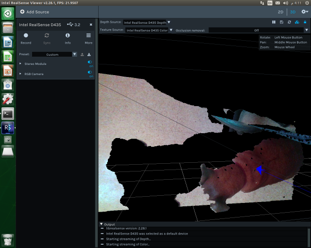

# RealSense D435i 설치와 확인

현재 Go2 Jetson AGX Orin은 JetPack `6.2.1` 환경이다.

## 1. APT 패키지로 설치

D435i는 아직 꽂지 않은 상태에서 진행한다.

```bash
sudo apt-get update
sudo apt-get install -y curl gpg apt-transport-https

sudo mkdir -p /etc/apt/keyrings
curl -sSf https://librealsense.realsenseai.com/Debian/librealsenseai.asc | \
  gpg --dearmor | \
  sudo tee /etc/apt/keyrings/librealsenseai.gpg > /dev/null

echo "deb [signed-by=/etc/apt/keyrings/librealsenseai.gpg] https://librealsense.realsenseai.com/Debian/apt-repo $(lsb_release -cs) main" | \
  sudo tee /etc/apt/sources.list.d/librealsense.list

sudo apt-get update
sudo apt-get install -y librealsense2-utils
```

설치가 끝나면 D435i를 Jetson의 USB 3 포트에 연결한다.

```bash
lsusb | grep -i realsense
rs-enumerate-devices
realsense-viewer
```

확인 기준:

| 확인 | 정상 상태 |
|---|---|
| `lsusb` | 출력에 `RealSense` 또는 `Intel` 장치가 보임 |
| `rs-enumerate-devices` | D435i 장치 정보가 출력됨 |
| `realsense-viewer` | 좌측 장치 패널에 D435i가 보임 |

`realsense-viewer`에서 Depth나 RGB 스트림을 켤 수 있으면 설치가 끝난 것이다.
장치가 보이지 않으면 3장의 방식으로 다시 설치한다.

## 2. RealSense Viewer 화면



| 위치 | 설명 |
|---|---|
| 좌측 장치 패널 | 연결된 D435i와 센서 모듈 표시 |
| Stereo Module | Depth/Infrared 스트림 켜기 |
| RGB Camera | Color 스트림 켜기 |
| 2D / 3D | 영상 보기와 포인트클라우드 보기 전환 |
| 중앙 화면 | 선택한 Depth, Color, IMU, 3D 화면 표시 |
| 하단 Output | 장치 연결, 스트리밍 상태, 오류 로그 표시 |

## 3. APT 설치 후 D435i가 보이지 않을 때

D435i를 뽑은 상태에서 진행한다.

```bash
sudo apt-get purge -y 'librealsense2*'
sudo apt-get autoremove -y

sudo apt-get update
sudo apt-get install -y \
  git cmake build-essential pkg-config \
  libssl-dev libusb-1.0-0-dev libudev-dev \
  libgtk-3-dev libglfw3-dev libgl1-mesa-dev libglu1-mesa-dev

cd ~
git clone https://github.com/realsenseai/librealsense.git
cd librealsense

./scripts/setup_udev_rules.sh

mkdir -p build
cd build
cmake .. \
  -DCMAKE_BUILD_TYPE=Release \
  -DBUILD_EXAMPLES=true \
  -DFORCE_RSUSB_BACKEND=true \
  -DBUILD_WITH_CUDA=true

make -j$(($(nproc)-1))
sudo make install
sudo ldconfig
```

D435i를 다시 연결한다.

```bash
rs-enumerate-devices
realsense-viewer
```

CUDA 오류가 나면 CMake 명령에서 `-DBUILD_WITH_CUDA=true`를 빼고 다시 실행한다.

## 4. 참고 문서

- [Intel RealSense Jetson 설치 문서](https://github.com/realsenseai/librealsense/blob/master/doc/installation_jetson.md)
- [Intel RealSense Linux 배포 패키지 문서](https://github.com/realsenseai/librealsense/blob/master/doc/distribution_linux.md)
- [libuvc/RSUSB 백엔드 설치 문서](https://github.com/realsenseai/librealsense/blob/master/doc/libuvc_installation.md)